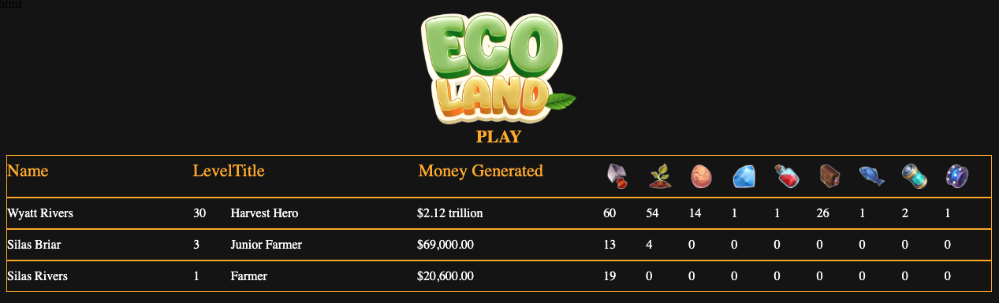

# Ecoland - Future Farm Lands - Server

This is a basic express server, working as a basic rest api for Ecoland - Future Farm Lands clicker

* Run: `$ npm install`
* `$ npm run start` will start server
* `process.env.MONGODB_URI` required pointing to a mongo database
* You can find rankings in `/games` directoory
  
